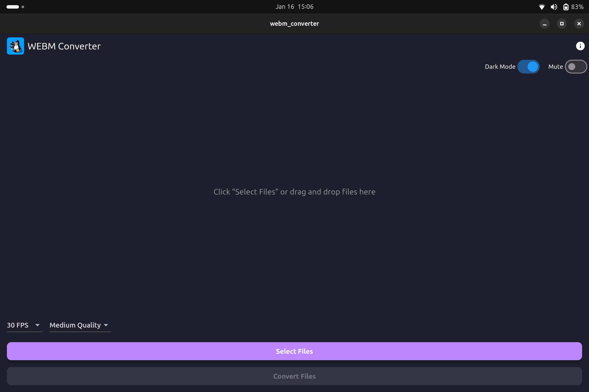
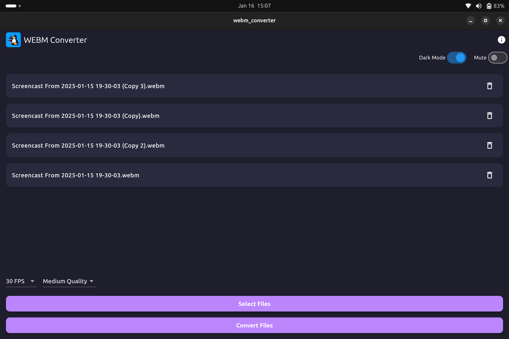
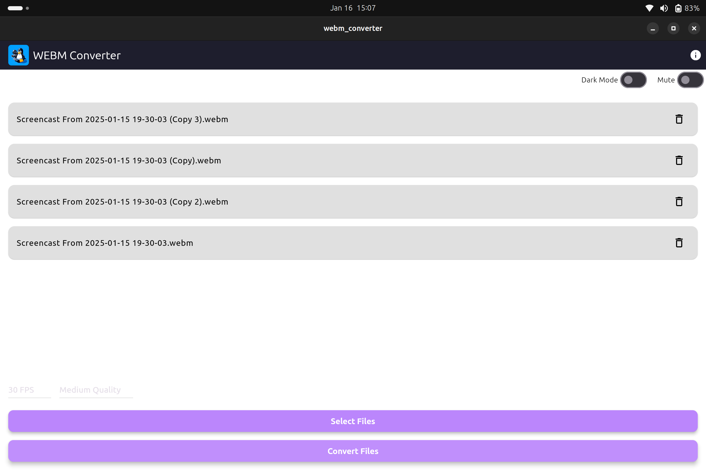
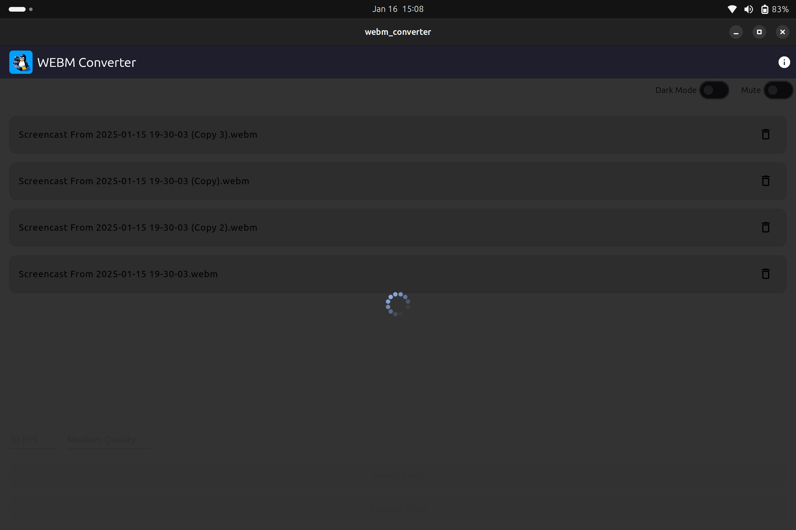

# WEBM converter v 1.0.3


This app currently allows you to convert webm files to mp4 files in linux. This functionality is made possible by ffmpeg, without which the app would not work. While I know this can be done via the terminal, I wanted to contribute to the open-source world by providing a graphical app to do it :)

## About v 1.0.3

This is the fourth update to the app, introducing numerous improvements and new features, including:

1. **arm64 support**: The app now works on ARM-based Linux systems in addition to amd64.  
2. **User preferences**: Added options for dark mode and light mode, as well as an option to mute the app.  
3. **Sound feedback**: Added sound effects to provide better feedback to the user.  
4. **General code improvements**: Enhanced performance and stability.  


## Installation

The latest version of this app is available on the Snap Store:
https://snapcraft.io/webm-converter







## Prerequisites (for Non-Snap Installation)

Before using the app, ensure that FFmpeg is installed on your system. If it is not installed, you can add it using the package manager specific to your Linux distribution. For example:

```bash
sudo apt-get update
sudo apt-get install ffmpeg
```


## TODO
1. Make the app standalone without the need for FFmpeg (potentially using the Flutter FFmpeg package).
2. Add support for more video file types for conversion.
3. Extend the app to be compatible with multiple operating systems (currently only distros with snaps).
4. Add conversion percentage of the files.


Feel free to contribute by addressing these TODO items or by submitting new features and enhancements. Your contributions are highly appreciated!

