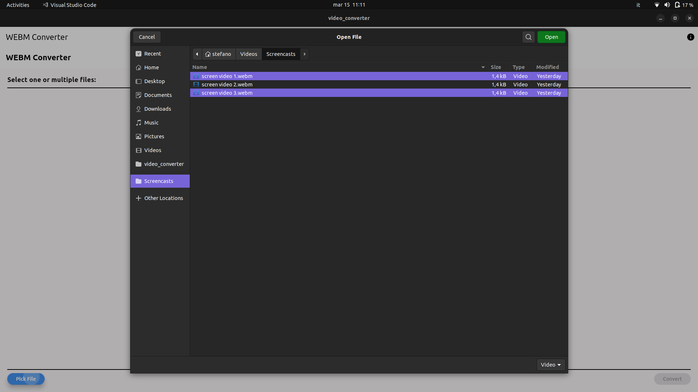

# Video Converter

This app currently allows you to convert webm files to mp4 files in linux. This functionality is made possible by ffmpeg, without which the app would not work. While I know this can be done via the terminal, I wanted to contribute to the open-source world by providing a graphical app to do it :)

## Prerequisites

Before using the app, ensure that FFmpeg is installed on your system. If not, you can install it using the package manager specific to your Linux distribution:

```bash
sudo apt-get update
sudo apt-get install ffmpeg
```


## Download
To use it just dowload the app from the repo and install the file
[DOWNLOAD THIS REPO](https://github.com/stefanospin7/video_converter_download)

You can follow the installation steps here:
[Video instructions](https://www.youtube.com/watch?v=AXRcRFt0kOE)





## TODO
1. Make the app standalone without the need for FFmpeg installation (potentially using the Flutter FFmpeg package).
2. Fix the window resizing issue.
3. Add support for more video file types for conversion.
4. Extend the app to be compatible with multiple operating systems.
5. Add conversion percentage of the files
6. improve the installation process

Feel free to contribute by addressing these TODO items or by submitting new features and enhancements. Your contributions are highly appreciated!

test commit
