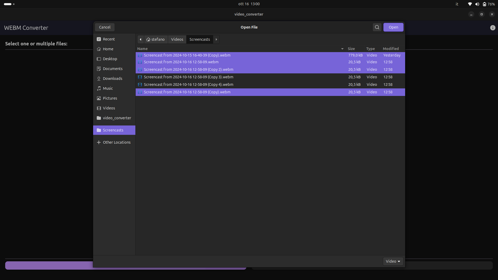
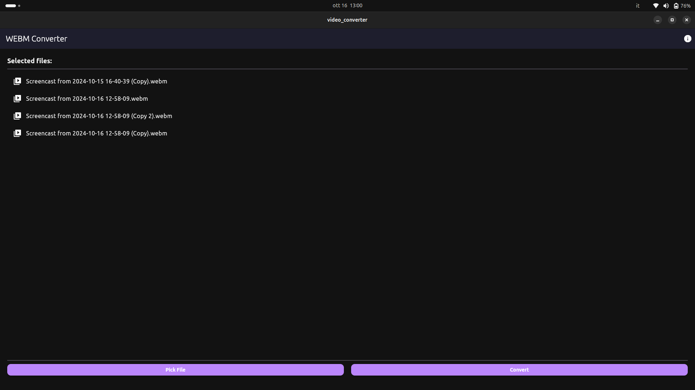

# WEBM converter v 1.0.1


This app currently allows you to convert webm files to mp4 files in linux. This functionality is made possible by ffmpeg, without which the app would not work. While I know this can be done via the terminal, I wanted to contribute to the open-source world by providing a graphical app to do it :)

## About v 1.0.1

This is the second updated version of this app, bringing numerous improvements and bug fixes, including:
1. A conversion speed approximately 12x faster than the previous version.
2. Better resulting video quality (both in fps and frame resolution).
3. Fixes the conversion crash bug for large files.
4. A modern, darker graphic redesign to reduce eye strain.
5. Fixed windows resizing bugs.
6. The creation of a new icon!


## Prerequisites

Before using the app, ensure that FFmpeg is installed on your system. If not, you can install it using the package manager specific to your Linux distribution:

```bash
sudo apt-get update
sudo apt-get install ffmpeg
```


## Download
To use it just dowload the app from the repo and install the file
(download only for v 1.0.0, 1.0.1 soon)
[DOWNLOAD THIS REPO](https://github.com/stefanospin7/video_converter_download)

You can follow the installation steps here:
[Video instructions](https://www.youtube.com/watch?v=AXRcRFt0kOE)






## TODO
1. Make the app standalone without the need for FFmpeg installation (potentially using the Flutter FFmpeg package).
2. Add support for more video file types for conversion.
3. Extend the app to be compatible with multiple operating systems (currently only Debian or Red Hat based distros).
4. Add conversion percentage of the files.
7. Add quality selection and fps selection.
8. Add user feedbacks


Feel free to contribute by addressing these TODO items or by submitting new features and enhancements. Your contributions are highly appreciated!

## UTILS

Clean/restart the project:
flutter clean
snapcraft clean
flutter build linux


Add the .desktop to bundle:
cp webm-converter.desktop build/linux/x64/release/bundle/

Build the Snap Package:
command "snapcraft" in the snapcraft.yaml file dir

LXD installation problem:
after adding the user in the lxd group reboot the system, restart session doesn't work

Test the Snap Package:
sudo snap install --dangerous --classic my-flutter-app_1.0.0_amd64.snap 


register app name:
https://dashboard.snapcraft.io/
